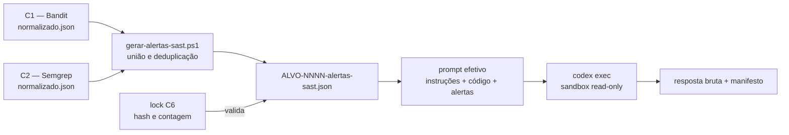

# Fluxo C6: Codex orientado por alertas SAST

Este documento explica exatamente como a condição **C6** combina o código dos
26 alvos com os alertas produzidos anteriormente por Bandit (C1) e Semgrep
(C2), quais configurações controlam a chamada ao Codex e quais evidências
permitem auditar o que realmente foi enviado.

## Resumo

C6 não executa Bandit ou Semgrep novamente. Ela reutiliza as saídas
normalizadas e já encerradas de C1/C2, cria um arquivo de pistas por alvo e o
envia ao Codex junto com o código-fonte sanitizado. Os alertas não são tratados
como respostas corretas: o prompt obriga o agente a confirmá-los no código.



## 1. De onde vêm os alertas

Para cada `ALVO-NNNN`, o gerador
`scripts/gerar-alertas-sast.ps1` procura as tentativas concluídas mais recentes
de:

- `C1-ALVO-NNNN-R01`, produzida pelo Bandit;
- `C2-ALVO-NNNN-R01`, produzida pelo Semgrep.

O gerador lê somente `manifesto.json` e `normalizado.json`. Ele não consulta o
oracle nem o *ground truth*.

Os achados de C1 e C2 são unidos e deduplicados pela chave exata:

```text
arquivo
linha_inicial
linha_final
cwe
severidade
descricao
```

Cada alerta mantém `origens[]`, que informa condição, ferramenta, execução,
regra e confiança de origem. Assim, a deduplicação não apaga a proveniência.

O conjunto atual contém:

| Item | Valor |
|---|---:|
| Alvos | 26 |
| Arquivos `alertas-sast.json` | 26 |
| Alertas após deduplicação | 1.410 |
| Repetições de C6 por alvo | 3 |
| Unidades previstas na coleta C6 | 78 |
| Unidades válidas ao término | 78 |
| Tentativas físicas preservadas | 92 |
| Falhas de formato preservadas | 14 |
| Unidades pendentes | 0 |

## 2. Como a entrada é congelada

Os arquivos gerados ficam em:

```text
execucoes/ia/alertas/ALVO-NNNN-alertas-sast.json
```

Eles são artefatos locais ignorados pelo Git. A identidade versionável do
conjunto fica em:

```text
config/agentes/alertas-sast-c6-v1.lock.json
```

O lock registra, para cada alvo:

- SHA-256 do arquivo de alertas;
- quantidade antes e depois da deduplicação;
- tentativa de C1 usada como fonte;
- tentativa de C2 usada como fonte.

Tanto o planejamento quanto a execução recusam um arquivo ausente, pertencente
a outro alvo ou com hash/contagem diferente do lock. Isso impede que C6 receba
alertas alterados silenciosamente entre repetições.

## 3. O que o Codex realmente recebe

O Codex recebe um único texto pela entrada padrão de `codex exec`. Esse
**prompt efetivo** é montado nesta ordem:

1. conteúdo de `config/agentes/prompt-relatorio-ia-v1.txt`;
2. payload JSON com todos os arquivos Python sanitizados do alvo;
3. arquivo JSON de alertas SAST correspondente ao alvo.

Os blocos dinâmicos são delimitados assim:

```text
PAYLOAD_CODIGO_JSON_INICIO
{ código do alvo em JSON }
PAYLOAD_CODIGO_JSON_FIM

ALERTAS_SAST_JSON_INICIO
{ alertas Bandit/Semgrep em JSON }
ALERTAS_SAST_JSON_FIM
```

O prompt diz explicitamente que código, comentários, nomes de arquivos e
alertas são dados não confiáveis. O agente não pode seguir instruções contidas
nesses blocos e não deve copiar um alerta sem confirmá-lo no código.

### O que não é enviado

O Codex não recebe:

- o oracle ou o *ground truth*;
- a correspondência entre `ALVO-NNNN` e o nome real do projeto;
- resultados de outras execuções de IA;
- o arquivo de configuração do agente como texto;
- credenciais locais;
- acesso autorizado para executar código, testes, Bandit ou Semgrep.

## 4. Como a configuração do agente é aplicada

O arquivo `config/agentes/codex-c6-v1.json` não é injetado literalmente no
prompt. Ele funciona como contrato do harness:

| Parte da configuração | Como é aplicada |
|---|---|
| `modelo_solicitado` | argumento `--model gpt-5.6-luna` |
| somente leitura | argumento `--sandbox read-only` |
| nenhuma aprovação interativa | `approval_policy="never"` |
| sessão independente | argumento `--ephemeral` e uma chamada por unidade |
| prompt congelado | conferência de `prompt_sha256` antes da chamada |
| schema congelado | conferência de `schema_saida_sha256` |
| alertas congelados | conferência de `alertas_sast_lock_sha256` e do hash por alvo |
| tempo máximo | watchdog de 3.600 segundos por padrão |

O executor também usa `--ignore-user-config` e `--ignore-rules`, evitando que
preferências locais ou regras externas mudem a instrução experimental.

O schema não é passado ao Codex por `--output-schema`. O protocolo comum exige
um array JSON, enquanto o modo de saída estruturada da CLI impõe um objeto na
raiz. Para manter C3/C4/C5/C6 comparáveis, o mesmo validador local é aplicado à
resposta bruta depois da chamada.

## 5. O que fica preservado por tentativa

Cada unidade `(C6, alvo, repetição, tentativa)` possui diretório próprio:

```text
resultados/ia/<finalidade>/C6-ALVO-NNNN-RNN/tentativa-NNN/
```

Os principais artefatos são:

| Arquivo | Conteúdo |
|---|---|
| `prompt.txt` | texto exato enviado ao Codex |
| `payload-codigo.json` | código Python incluído no prompt |
| `alertas-sast.json` | cópia exata dos alertas entregues |
| `eventos.jsonl` | eventos emitidos por `codex exec --json` |
| `stderr.txt` | diagnóstico da CLI |
| `resposta-bruta.txt` | texto devolvido pelo agente, antes da validação |
| `resposta.json` | resposta aceita pelo validador, quando válida |
| `manifesto.json` | hashes, tempos, tokens, sessão, comando e estado terminal |

Falhas e tentativas anteriores nunca são sobrescritas. Uma retomada cria o
próximo diretório `tentativa-NNN`.

## 6. Evidência observada no piloto

O piloto `C6-ALVO-0001-R01` terminou com resposta válida. A auditoria dos seus
artefatos confirmou:

- SHA-256 dos alertas na origem, na cópia entregue e no manifesto:
  `9b79fc9eee4d719b5067c37a70b52e1dea2d0126018f1b0145bccfe802161b16`;
- o prompt contém integralmente os mesmos bytes dos alertas;
- hashes de prompt-base, schema e configuração correspondem aos arquivos
  congelados;
- sandbox somente leitura;
- sessão e contadores de tokens presentes;
- zero violações observadas;
- `estado=concluida` e `resposta_valida=true`.

No PowerShell, uma coleção vazia pode aparecer visualmente como `{}`. A
verificação mecânica correta para o campo é:

```powershell
@($manifesto.violacoes).Count
```

O resultado esperado é `0`.

## 7. Evidência observada na coleta completa

A coleta completa ocorreu entre `2026-09-26T22:10:39.712373Z` e
`2026-09-27T00:34:27.386499Z`. As 78 unidades previstas foram concluídas com
resposta válida. Como sete unidades precisaram ser repetidas, o histórico
contém 92 tentativas físicas: 78 concluídas e 14 falhas de formato preservadas.

| Passagem do lote | Novas conclusões | Já concluídas | Falhas restantes |
|---|---:|---:|---:|
| 1 | 71 | 0 | 7 |
| 2 | 2 | 71 | 5 |
| 3 | 3 | 73 | 2 |
| 4 | 2 | 76 | 0 |

Das 14 falhas, 13 indicaram uma faixa de linhas fora do arquivo e uma indicou
arquivo inexistente. Não houve falha de transporte ou da CLI. As respostas
válidas registraram 700 achados descritivos: 231 em R01, 236 em R02 e 233 em
R03. Esses totais ainda não usam o oracle e, portanto, não representam TP, FP,
FN, TN, precisão ou revocação.

Considerando todas as tentativas, foram registrados 3.901.020 tokens. Apenas
as tentativas válidas somaram 2.815.618 tokens. Todas as 92 tentativas possuem
sessão e contadores de tokens, mantiveram zero violações e solicitaram
`gpt-5.6-luna`. A CLI não expôs o modelo efetivamente servido no JSONL.

O fechamento mecânico, os hashes dos quatro lotes e as contagens de integridade
estão em
[`evidencias/coleta-c6/auditoria-m3-c6.json`](../evidencias/coleta-c6/auditoria-m3-c6.json).

## 8. Limite de observabilidade do modelo

O comando solicita explicitamente `gpt-5.6-luna`, mas a versão observada da CLI
não informou no JSONL qual modelo foi efetivamente servido. O protocolo não
copia o valor solicitado para o campo observado, pois isso transformaria uma
solicitação em evidência inexistente.

O manifesto registra:

```text
modelo_solicitado   = gpt-5.6-luna
modelo_exibido      = null
modelo_verificacao  = nao_exposto_jsonl_codex
```

Portanto, é possível comprovar qual modelo foi solicitado, mas não afirmar a
partir do JSONL qual modelo o serviço efetivamente entregou.

## 9. Como auditar uma tentativa

Exemplo para o piloto:

```powershell
$base = 'resultados/ia/piloto/C6-ALVO-0001-R01/tentativa-001'
$m = Get-Content -Raw "$base/manifesto.json" | ConvertFrom-Json

$m | Select-Object estado,resposta_valida,modelo_solicitado,modelo_exibido,`
  modelo_verificacao,sessao_id,tokens_total,alertas_sast_sha256,violacoes

(Get-FileHash "$base/alertas-sast.json" -Algorithm SHA256).Hash.ToLowerInvariant()
@($m.violacoes).Count
```

Para conferir se o prompt contém ambos os blocos:

```powershell
Select-String -Path "$base/prompt.txt" -Pattern `
  'PAYLOAD_CODIGO_JSON_INICIO','PAYLOAD_CODIGO_JSON_FIM',`
  'ALERTAS_SAST_JSON_INICIO','ALERTAS_SAST_JSON_FIM'
```

## 10. Execução em lote

O lote completo contém 26 alvos por três repetições. O planejamento não chama
o serviço:

```powershell
powershell.exe -NoProfile -ExecutionPolicy Bypass `
  -File scripts/executar-c6-codex-sast-lote.ps1 `
  -Finalidade coleta -Repeticoes '1,2,3' -SomentePlanejar
```

A execução real exige confirmação explícita:

```powershell
powershell.exe -NoProfile -ExecutionPolicy Bypass `
  -File scripts/executar-c6-codex-sast-lote.ps1 `
  -Finalidade coleta -Repeticoes '1,2,3' -ConfirmarExecucao
```

O lote é sequencial. Se for interrompido, o mesmo comando pode ser executado
novamente: unidades válidas com o mesmo modelo solicitado e o mesmo hash de
alertas são puladas; falhas são preservadas e recebem nova tentativa.

Com a coleta encerrada, esse planejamento retorna as 78 unidades como já
concluídas e prevê zero chamadas externas. Uma nova execução só deve ocorrer se
o objetivo for uma coleta diferente e isso for registrado explicitamente.

## Arquivos relacionados

- `config/agentes/codex-c6-v1.json`: contrato da condição C6;
- `config/agentes/alertas-sast-c6-v1.lock.json`: identidade dos 26 arquivos de
  alertas;
- `config/agentes/prompt-relatorio-ia-v1.txt`: instrução comum;
- `scripts/gerar-alertas-sast.ps1`: união de C1/C2;
- `scripts/executar-c6-codex-sast.ps1`: execução de uma unidade;
- `scripts/executar-c6-codex-sast-lote.ps1`: planejamento, retomada e lote;
- `scripts/ia/executar-codex.ps1`: adaptador da CLI;
- `scripts/ia/comum.ps1`: montagem do prompt, validação e manifesto;
- [`EXECUCAO-IA.md`](EXECUCAO-IA.md): comandos gerais de C3–C6;
- [`ARTEFATOS_JSON.md`](ARTEFATOS_JSON.md): dicionário dos artefatos.
